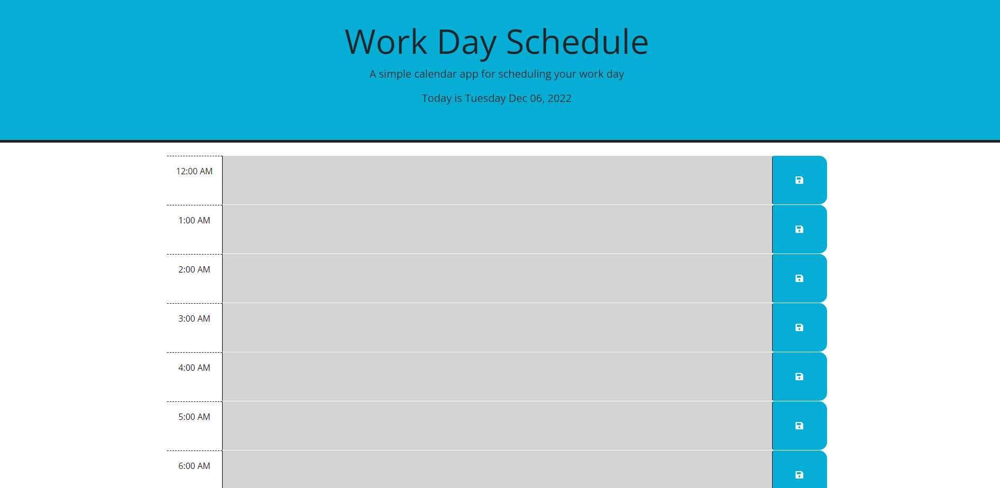
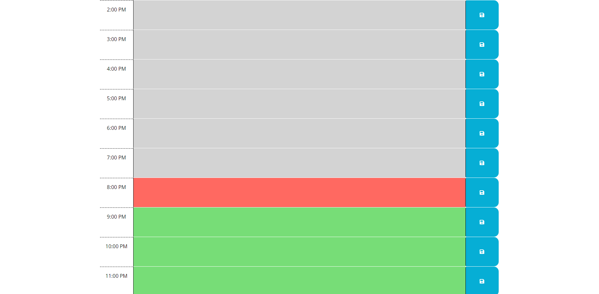

# work-day-scheduler-id

## Description

The project is a day planner that allows the user to insert information that can be saved to your 24 hour planner. The date and time is based on the users time zone that is set in the local storage.

## Usage

This application is compatible with most devices so you can follow the link provided.

## Link

You can find the deployed application here:
https://isaackice.github.io/work-day-scheduler-id/

## Screenshot
`
    
``
``
    

## Credits

Professor Joe Han
Teachers Assistant Manolis Koutouzos
Teachers Assistant Paul Cwik
Classmate Jonathan Plaras
Classmate Eric Kirberger
Classmate Valentina Guevara
W3schools
Bootstrap
JQuery

## License

MIT License //
Refer to repository